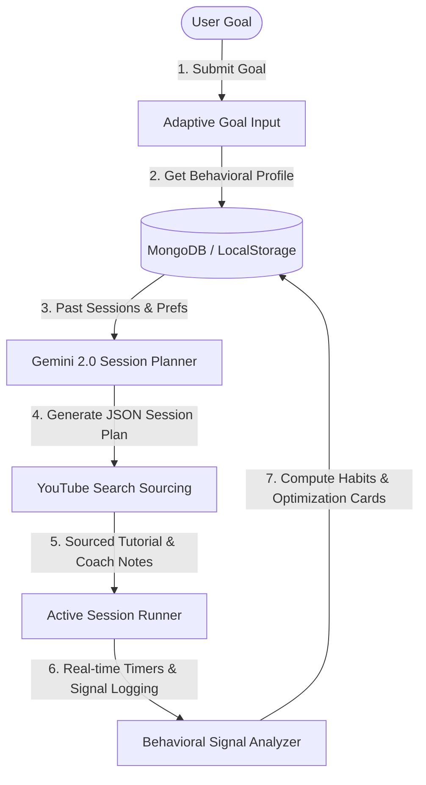

# MotivateAI 🔥
### Your Autonomous AI Agent for Building Consistency

> **Built for the Google Gemini Hackathon** — An AI-powered learning coach that actively builds sustainable work habits by dynamically scheduling tasks, sourcing real-world learning materials, and intelligently managing breaks.

[](https://motivateai-471444428139.europe-west1.run.app)
[](https://github.com/aaminashihab/MotivateAI)
[](https://nextjs.org)
[](https://ai.google.dev)

---

## 💡 The Problem
Self-directed online learning is fundamentally broken. Over **95% of self-learners drop out** of online courses. 
* **Content platforms**  provide great videos but offer *zero accountability*. Once momentum drops, the user disappears.
* **Habit trackers** (Streaks, Habitica) gamify completion but lack *cognitive depth*. They track that you did "something" but don't adapt to how you actually learn or struggle.
* **Human tutors** provide excellent coaching but are *expensive, unavailable 24/7, and hard to scale*.

Traditional learning is one-size-fits-all. It doesn't care if you're flying through concepts in 2 minutes and getting bored, or struggling on a coding bug for hours and getting frustrated.

---

## 🧠 The Solution: MotivateAI
MotivateAI acts as your **always-on cognitive learning companion**. Using **Google Gemini 2.0**, it analyzes your real-time learning signals—such as historical task completion rates, average focus durations, optimal break intervals, and focus drop-off thresholds—to dynamically customize and schedule every micro-session specifically to your focus habits.



---

## ✨ Core Features

### 1. Autonomous Session Generation
Submit any learning goal (e.g., *"Learn Python encapsulation"*). Gemini 2.0 reviews your profile history, calculates your momentum, and generates an optimized curriculum split into bite-sized tasks. It automatically fetches a relevant YouTube tutorial and places a **personalized Coach Note** below the video, guiding you to the most relevant timestamp so you never waste time.

### 2. Empathic AI Coach Check-in
Every time you load the dashboard, an autonomous AI coach greets you with a highly personalized message generated by Gemini. It references your actual history—streak status, the last concept you successfully completed, or a gentle, non-guilt-tripping nudge if you've been away for a couple of days.

### 3. Active Session Runner & Break Manager
Each task features a dedicated circular SVG countdown timer. Between sessions, a break timer triggers with a motivational quote and customized break activities (hydration, deep breathing, quick stretches) based on your fatigue patterns. 

### 4. Interactive Behavioral Analytics
Your Profile page features full-scale visual reporting powered by **Recharts**:
* **Consistency Trend:** A 7-day line chart illustrating task completion rates aligned with a weighted engagement score.
* **Peak Performance Times:** A bar chart grouping your highest performance scores by time of day, allowing you to schedule difficult tasks at your optimal productivity window.
* **Task Difficulty Breakdown:** A donut chart showing your comfort levels with Easy, Medium, and Hard tasks.
* **Weekly Aggregations:** Total study hours, active sessions, and active day streaks.

### 5. "How We've Optimized for You" Engine ⭐
The crowning feature: Click the **Run Optimization Engine** to trigger a Gemini analysis over your last 30 sessions. The model reviews your average break skip rates and performance drop-offs, generates concrete before/after comparisons, writes a detailed clinical reasoning, and **automatically applies the new settings** directly into your user preferences profile.

---

## 🛠️ Technology Stack

* **Frontend:** Next.js 16 (App Router), React 19, TypeScript
* **Styling:** Tailwind CSS with a gorgeous **Dark Glassmorphism UI** featuring sleek neon purple glows, translucent panels, and micro-interactions.
* **Database:** MongoDB for robust, scalable session logs, user preferences, and optimization logs.
* **AI Model:** Google Gemini 2.0 Flash (via `@google/generative-ai` SDK) utilizing strict JSON schema enforcement (`responseSchema`) and system instruction partitioning.
* **Integrations:** YouTube Data API v3 for targeted video sourcing.

---

## 🔒 Security & Validation

* **Prompt Sanitization:** All user goals are truncated to 100 characters and sanitized against prompt-injection patterns (e.g., *"ignore previous instructions"*).
* **System Isolation:** System-level instructions are partitioned completely inside Gemini's official `systemInstruction` parameters, blocking user-input override attacks.
* **JSON Schema Enforcement:** Every Gemini API call strictly enforces a structured `responseSchema` to guarantee programmatic Type Safety on the client side.

---

## 🚀 Quick Start & Installation

Because MotivateAI is configured to deploy directly in the cloud, you can run it without local environment worries!

### 1. Clone the repository
```bash
git clone https://github.com/aaminashihab/MotivateAI.git
cd MotivateAI
```

### 2. Install dependencies
```bash
npm install
```

### 3. Configure Environment Variables
Create a `.env.local` file in your root directory:
```env
# Gemini API Key (aistudio.google.com)
GEMINI_API_KEY=your_gemini_api_key_here

# YouTube Data API v3 (console.cloud.google.com)
YOUTUBE_API_KEY=your_youtube_api_key_here

# MongoDB Connection String (mongodb.com)
MONGODB_URI=your_mongodb_connection_string_here
```

### 4. Run the development server
```bash
npm run dev
# Open http://localhost:3000 in your browser
```

---

## ☁️ Production Deployment (Google Cloud Run)

The application includes a optimized multi-stage `Dockerfile` and a pipeline configured to continuously build and deploy on push via Cloud Build to Google Cloud Run.

To manually trigger a deployment to Google Cloud Run:
```bash
# Set up variables in Cloud Run
gcloud run services update motivateai \
  --set-env-vars GEMINI_API_KEY=xxx,YOUTUBE_API_KEY=xxx,MONGODB_URI=xxx \
  --region us-central1
```
